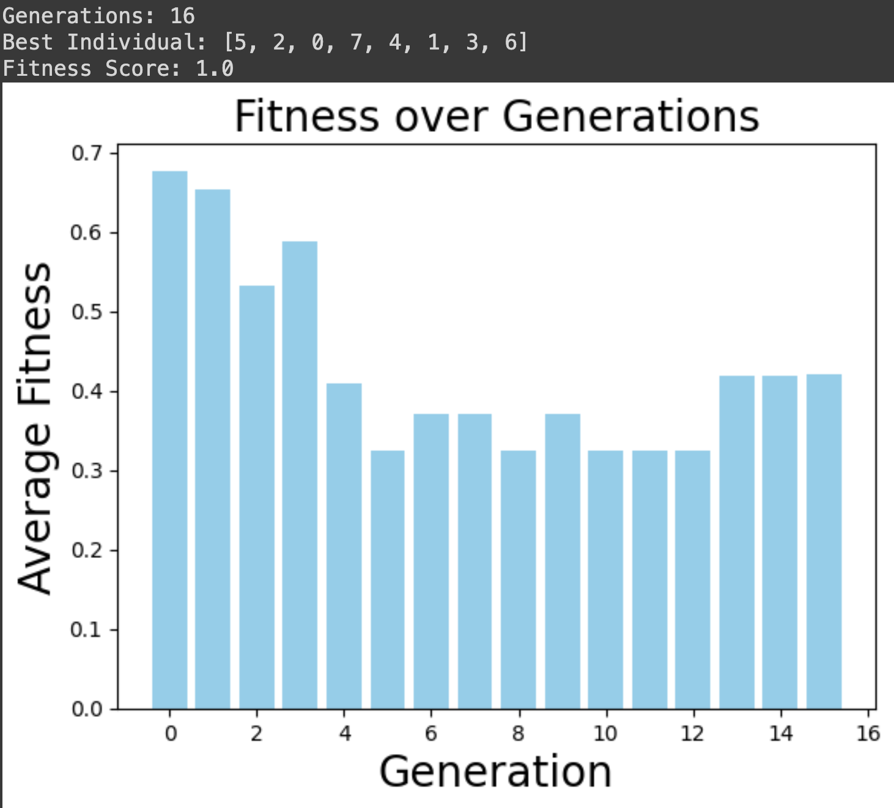
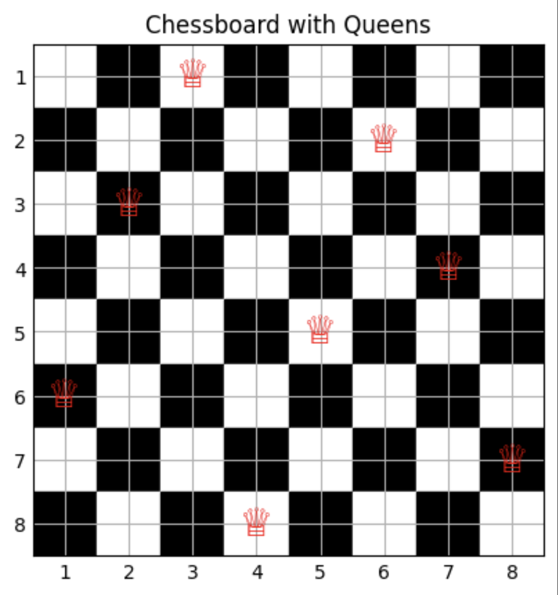

# Genetic Algorithm for 8-Queens Problem

This repository contains Python code implementing a genetic algorithm to solve the 8-Queens problem. Below is a brief overview of genetic algorithms in evolutionary algorithms.

## Genetic Algorithms

Genetic algorithms are a class of optimization algorithms inspired by the principles of natural selection and genetics. They are particularly useful for solving complex optimization problems where traditional methods may be inefficient or impractical.

### Key Concepts:
- **Chromosome:** Represents a potential solution to the problem.
- **Population:** A collection of chromosomes (candidate solutions) evolving over generations.
- **Fitness Function:** Evaluates how good each chromosome is (quality of solution).
- **Selection:** Mechanism to choose parents based on their fitness.
- **Crossover:** Breeds new offspring by combining genetic material (chromosomes) of parents.
- **Mutation:** Introduces random changes in offspring to maintain diversity.

### Evolutionary Algorithms
Evolutionary algorithms, including genetic algorithms, simulate the process of natural selection to solve optimization problems. They iteratively improve solutions by mimicking biological evolution mechanisms such as selection, crossover, and mutation.

## 8-Queens Problem

The 8-Queens problem presented here is a simplified example of the more generalized N-Queens problem, where N queens are to be placed on an N×N chessboard. This genetic algorithm can be extended to solve the N-Queens problem by adjusting the board size and number of queens accordingly.

## Implementation Details

- **create_individual:** Generates a random arrangement of queens on the board.
- **generate_population:** Creates a population of such arrangements.
- **parent_selection:** Selects potential parents based on their fitness.
- **crossover:** Combines genetic material of parents to produce offspring.
- **mutation:** Introduces random changes in offspring to maintain diversity.
- **fitness_score:** Evaluates the fitness of a chromosome based on the number of non-attacking queen pairs.
- **population_fitness:** Computes the overall fitness of the entire population.
- **check_end:** Determines if a satisfactory solution has been found.
- **generate_next_population:** Generates the next generation of solutions using selection, crossover, and mutation.

## Usage

To run the genetic algorithm and solve the 8-Queens problem:

```python
# Initialize parameters and run the algorithm
generation = 0
fitness = []

population = generate_population()
individuals_fitnesses, total_fitness = population_fitness(population)

while not check_end(population):
    new_population = generate_next_population(population, individuals_fitnesses) # crossover and mutation
    population = next_generation_selection(new_population)
    individuals_fitnesses, total_fitness = population_fitness(population)

    generation += 1
    avg_fit = total_fitness / len(population)
    fitness.append(avg_fit)

# Display results
print(f"Generations: {generation}")
best_individual = max(population, key=lambda x: fitness_score(x))
print(f"Best Individual: {best_individual}")
print(f"Fitness Score: {fitness_score(best_individual)}")

# Visualize fitness over generations
plt.bar(range(generation), fitness, color='skyblue')
plt.xlabel('Generation', fontsize=20)
plt.ylabel('Average Fitness', fontsize=20)
plt.title('Fitness over Generations', fontsize=20)
plt.savefig('average_fitness.png')
plt.show()

# Draw the chessboard with queens for the best individual found
draw_chessboard(best_individual)
plt.savefig('solved_problem.png')
```

## Draw Chessboard

The `draw_chessboard` function visualizes the placement of queens on the chessboard, helping to visualize the solution found by the genetic algorithm.

## Example of Solved 8-Queens Problem

#### Average Fitness Diagram



#### Visualized Solved Problem



